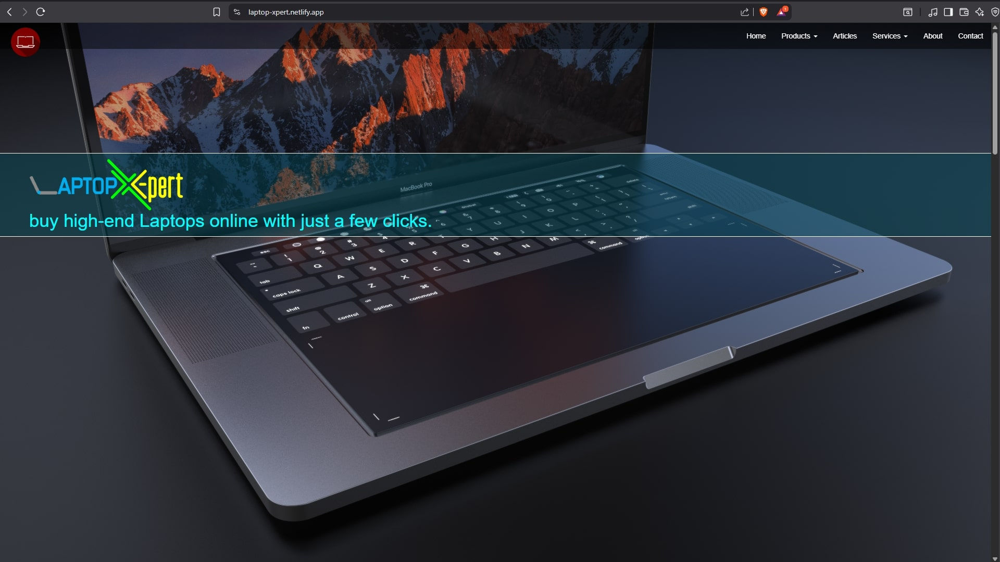
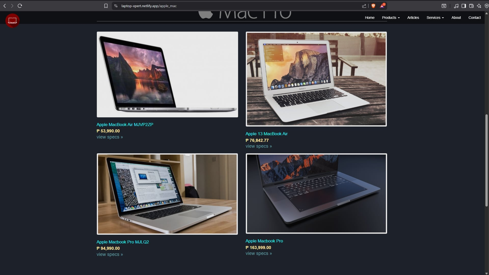

# Laptop Xpert (Website Project)

A simple laptop shop website built using **HTML**, **CSS**, **JavaScript**, and **Bootstrap**.

**Visit Here:** [https://laptop-xpert.netlify.app/](https://laptop-xpert.netlify.app/)

**Live Demo:** https://youtu.be/0VrKqB-ptHk

## Overview

Laptop Xpert is a school project originally developed in **2017** as part of an academic requirement focused on basic web design and front-end development.  
The website showcases an all-in-one laptop shop featuring both **Windows laptops** and **MacBook laptops**, along with pages for delivery information, contact details, service centers, and company background.

## Features

- Product listings for Windows laptops and MacBooks
- Basic UI built with Bootstrap components
- Simple JavaScript interactions and page behavior
- Static pages for:
  - Product page for Windows and Apple Laptops
  - Delivery information
  - Contact detail
  - Shipping details
  - Service center details
  - About the company

## Tech Stack

| Technology | Description                         |
| ---------- | ----------------------------------- |
| HTML       | Structure and layout of the website |
| CSS        | Styling and visual presentation     |
| JavaScript | Basic interactive features          |
| Bootstrap  | Responsive UI framework             |

## Project Notes

- Created as an academic requirement in 2017
- Focused on practicing front-end fundamentals
- Fully static project without backend integration
